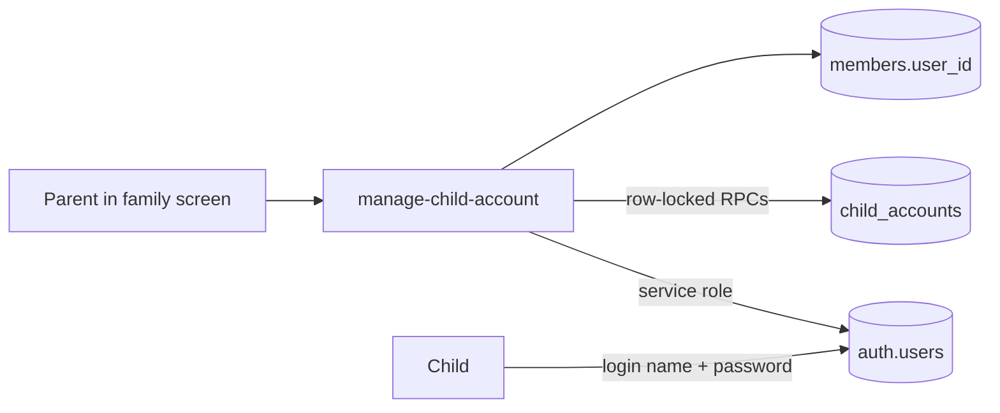

# Rodinka managed child accounts deployment and operations

Managed child accounts let an adult create a sign-in for a child who already exists as a household member. Credentials live only in Supabase Auth; `members.user_id` remains the canonical "this person can sign in" link, and `child_accounts` only describes the managed account wrapped around it.



Unlike the reminder functions, `manage-child-account` is called **from the browser**. That makes its deployment state directly visible to users: if the function is missing, the browser reports a CORS failure rather than a 404, because a 404 carries no `Access-Control-Allow-Origin` header.

## Deployment

Two halves must both be deployed. Applying only the migration leaves the account UI visible but every action failing.

```powershell
npx supabase db push
npx supabase functions deploy manage-child-account --no-verify-jwt --use-api
```

`--no-verify-jwt` is required and is **not** a relaxation of security. With platform JWT verification enabled, the unauthenticated `OPTIONS` preflight a browser sends is rejected before the function runs, so every call fails at CORS. The function performs its own authentication instead: it requires a `Bearer` token, resolves the caller with `auth.getUser(token)`, and re-derives the actor's family and role from their own `members` row. `supabase/config.toml` records this as `[functions.manage-child-account] verify_jwt = false`.

`--use-api` bundles through the API-side builder, which follows the function's relative import of `src/lib/childAccountIdentity.ts` from outside the functions directory. `scripts/check-edge-imports.mjs` guards that import graph in CI.

| Environment item | Location | Public or secret | Purpose |
|---|---|---|---|
| `SUPABASE_URL` | Injected by the platform | Public | Project API base URL |
| `SUPABASE_ANON_KEY` | Injected by the platform | Public | Caller-scoped client used to validate the bearer token |
| `SUPABASE_SERVICE_ROLE_KEY` | Injected by the platform | Secret | Auth admin operations and the service-role-only lifecycle RPCs |

No manual secrets are required: Supabase injects all three into every Edge Function. The service role key must never appear in a `VITE_*` variable or any frontend bundle.

## Verifying a deployment

The preflight is the check that matters, because it is what the browser does first:

```powershell
curl -i -X OPTIONS `
  -H "Origin: https://moje-rodinka.vercel.app" `
  -H "Access-Control-Request-Method: POST" `
  "https://<project-ref>.supabase.co/functions/v1/manage-child-account"
```

Expected: `HTTP/1.1 200 OK` with `access-control-allow-headers: authorization, apikey, content-type, x-client-info`. An `HTTP 404` means the function is not deployed — this is the symptom that surfaces in the browser as *"Response to preflight request doesn't pass access control check: It does not have HTTP ok status."*

Then confirm the function rejects unauthenticated callers, which proves the in-function auth boundary survived `--no-verify-jwt`:

```powershell
curl -X POST "https://<project-ref>.supabase.co/functions/v1/manage-child-account" -H "content-type: application/json" -d '{"action":"provision","memberId":"00000000-0000-4000-8000-000000000000"}'
```

Expected: `401 {"ok":false,"error":"authentication_required"}`. Sending the anon key as the bearer token must return `401 invalid_session` — a valid JWT with no member row is still not an actor.

To confirm the migration is applied, read `child_accounts` with the anon key. The correct answer is a **permission error**, not an empty list: the table exists and `anon` is explicitly revoked. A `42P01 relation does not exist` means `db push` has not run.

## Lifecycle and authorization model

| Action | Server primitive | Guarantees |
|---|---|---|
| Create | `begin_` / `finalize_child_account_provision` + `auth.admin.createUser` | Row-locked reservation; concurrent adults cannot double-provision; a failed link deletes the created Auth user |
| Reset | `auth.admin.updateUserById` + `record_child_account_password_reset` | Old password stops working immediately |
| Revoke | `detach_child_account_access` + `auth.admin.deleteUser` | Detaches `members.user_id` and revokes push in one transaction, then deletes the Auth user |

Every action re-derives the caller's family and role server-side and rejects a target that is not an active child in that family. UI visibility is never authorization.

Passwords are generated in the browser (`src/lib/childPassphrase.ts`) because the function validates but does not generate them. They are sent over TLS like any typed credential, shown once, and never persisted or logged.

## Operational behaviour worth knowing

- **`cleanupPending: true`** on revoke means family access is already blocked but the orphaned Auth user survived. The login name stays reserved until that user is removed; re-provisioning the same name will fail as `account_unavailable`.
- **A `provisioning` row with no Auth user** can survive a crash between reservation and finalize. There is no reaper; an adult retrying creation overwrites the reservation.
- **Removing a child** revokes Auth access first (best-effort), then calls `remove_household_member`. If the function is unreachable the removal still proceeds: the RPC detaches `user_id` and revokes push on its own, so access is cut off regardless. Only the Auth user survives, keeping the login name reserved.
- **Restoring a member never restores credentials.** An adult must create access again explicitly.
- A revoked child's open browser reconciles on its next member query, clears the cached offline identity and lands on the signed-in-without-family recovery screen.

## Rollback

Deleting or reverting the function blocks all account management but does not touch existing access: children who already have credentials keep signing in, because that path is plain Supabase Auth. To cut off a specific child without the function, detach the link directly and let the trigger mark the account revoked:

```sql
update members set removed_user_id = coalesce(user_id, removed_user_id), user_id = null where id = '<member-id>';
```

Family history, chores, allowance and profiles are never removed by any revocation path.
