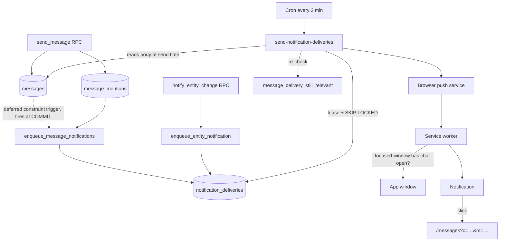

# Rodinka messaging push (batch 4)

Batch 4 adds push notifications for family messaging. It **extends** the
Phase 4.1 reminder pipeline rather than introducing a second engine: message
events enqueue rows into the existing `notification_deliveries` outbox, so
leases, retry/backoff, dead-subscription reaping, attempt auditing, VAPID
signing and the two-minute cron are all shared and unchanged.

See [supabase-web-push.md](supabase-web-push.md) for the underlying delivery
engine, VAPID setup and device management. This document covers only what
batch 4 adds.

## Push flow



The fan-out is a `DEFERRABLE INITIALLY DEFERRED` constraint trigger on
`messages`, so it runs at COMMIT. That is deliberate: `send_message` inserts
the message first and its mentions second, and a plain `AFTER INSERT` trigger
would classify every recipient before any mention row existed, so a mention
would never be recognised as one.

### Events

| Event | Kind | Preference column | Priority |
|---|---|---|---|
| New message in the family chat | `group` | `message_group_enabled` | normal |
| New direct message | `direct` | `message_direct_enabled` | high |
| Reply to your own message | `reply` | `message_reply_mention_enabled` | high |
| Explicit `@mention` of you | `mention` | `message_reply_mention_enabled` | high |
| Task assigned to you via chat | `task_assigned` | `message_task_enabled` | high |
| Shared entity change concerning you | `entity_changed` | `message_entity_enabled` | normal |

"High priority" means a higher web-push `urgency` header and `renotify: true`
on the notification, so it is not collapsed silently behind group chat.
It deliberately does **not** mean `importance = 'important'`: that is the flag
that bypasses quiet hours in the sender, and a direct message at 03:00 is not
a reason to override a user's quiet hours.

Ordinary system messages (`content_type = 'system'`) never push. Only the two
entity kinds above do, and only for the single member the change concerns.

### Suppression rules

A delivery is not enqueued, or is cancelled before sending, when:

- the recipient is the message author (`cm.member_id is distinct from new.sender_member_id`)
- the recipient has a fresh presence heartbeat for that conversation
- the conversation is muted (`mute_scope in ('all','messages')`, and `muted_until` is null or in the future)
- the per-type preference above is off
- account-level `push_enabled` is off (checked in the sender)
- quiet hours are in force (deferred, not dropped)
- the message was deleted between enqueue and send

Every one of these is evaluated **twice**: once by the trigger at enqueue
time, and again by the sender through `message_delivery_still_relevant`
immediately before encrypting the payload. The gap between the two is up to
two minutes of cron latency, which is more than long enough for a user to
open, mute or reconfigure the conversation.

### Presence

`conversation_presence` holds one row per (conversation, member) containing
nothing but a heartbeat timestamp — no content, no device identity, no user
agent. It is not readable by clients at all.

The client heartbeats every 30s while a conversation is open **and** the tab
is both visible and focused; the window is 75s, which tolerates one missed
beat. A merely-open background tab does not count as present, otherwise a
laptop left open on the family chat would swallow the notifications the
user's phone is waiting for.

The service worker performs a second, narrower check: before showing a chat
notification it asks live windows over a `MessageChannel` whether they have
that conversation open and focused, with a 700 ms timeout. This is a
backstop for the enqueue/send race only. Keeping it rare matters — suppressing
a push spends `userVisibleOnly` budget, and browsers eventually show a
generic "site updated in background" notice if a worker swallows too many.

### Idempotence

`notification_deliveries.idempotency_key` is `UNIQUE`. Messaging deliveries
use:

- messages: `msg:<message_id>:<member_id>`
- entities: `entity:<kind>:<type>:<entity_id>:<member_id>:<5-minute bucket>`

All inserts are `ON CONFLICT (idempotency_key) DO NOTHING`, so a statement
replay, a trigger re-fire or a backend retry collapse onto the same row. The
entity key carries a five-minute bucket so a genuine later re-assignment can
notify again while a double-tap cannot.

## Privacy

The outbox row **does not contain the message text**. It carries the sender's
display name as the title and the message id in metadata; the sender reads
the body from `messages` at delivery time. Two consequences, both intended:

1. The preview preference is applied at delivery, not at enqueue — turning
   "show message preview" off takes effect on everything already queued.
2. The outbox is not a second copy of the family's conversation history.

With preview off the payload is a fixed generic string (`Rodinka` /
"Nová zpráva v Rodince") and the real text is never encrypted into the push
at all. The settings screen shows a live example of exactly what the lock
screen will display in each mode.

`message_mentions` has no INSERT/UPDATE/DELETE policy: rows are written only
by the `send_message` security-definer RPC. That is what makes it safe for
mentions to have their own preference switch — a modified client cannot
fabricate a high-priority ping for someone who is not a participant.
`resolve_message_mentions` additionally requires the member's display name to
actually appear as `@Name` in the body, so a mention is always visible in the
text that produced it.

Sign-out calls `revoke_push_subscription_by_endpoint` for the current
endpoint only, before `supabase.auth.signOut()` — the RPC derives the user
from `auth.uid()`, so it must run while the session still exists. The browser
subscription is kept, because `register_push_subscription` clears
`revoked_at` on conflict and the next sign-in reactivates the same endpoint.
Other devices are untouched. Account deletion already removes subscriptions
through the `auth.users` cascade on `push_subscriptions.user_id`.

## Mentions

Mentions are resolved server-side. The composer sends the ids it matched
from its autocomplete as a **hint**; `send_message` re-resolves from the body
and drops anything that is not an active participant of that conversation.

The client and the database apply the same matching rule — the body contains
`@<display name>`, case-insensitively, longest name winning — so what is
highlighted in a bubble is exactly who was notified. `src/utils/mentions.ts`
is the single client-side implementation, shared by the composer autocomplete
and the bubble renderer.

## Environment variables

Batch 4 introduces **no new environment variables**. It reuses the batch 4.1
configuration in full:

| Item | Location | Purpose |
|---|---|---|
| `VITE_VAPID_PUBLIC_KEY` | Vercel frontend | `PushManager.subscribe()` application-server key |
| `VAPID_PUBLIC_KEY` | Supabase Edge secrets | Sender identity and fingerprint |
| `VAPID_PRIVATE_KEY` | Supabase Edge secrets | Signs VAPID requests |
| `VAPID_SUBJECT` | Supabase Edge secrets | Contact URI required by VAPID |
| `NOTIFICATION_SENDER_SECRET` | Supabase Edge secrets + Vault | Authenticates cron invocations |
| `rodinka_project_url` | Supabase Vault | Edge Function base URL for cron |
| `rodinka_notification_sender_secret` | Supabase Vault | Must equal `NOTIFICATION_SENDER_SECRET` |

## Manual deployment steps

Order matters: the migration replaces `send_message` and
`set_conversation_mute` with new signatures, and the deployed frontend calls
the new ones.

```powershell
# 1. Apply the migration (drops and recreates send_message with a sixth
#    parameter, and set_conversation_mute with a third).
npx supabase db push

# 2. Redeploy the sender so it understands messaging payloads.
npx supabase functions deploy send-notification-deliveries --no-verify-jwt

# 3. Deploy the frontend.
```

No new cron job and no new Vault secret are required — the existing
`rodinka-send-notifications-2m` schedule picks up messaging deliveries
automatically, because they land in the same outbox.

**Deployment window caveat.** Between step 1 and step 3 the old frontend
bundle calls `send_message` with five arguments while the database only
offers the six-argument form. PostgREST resolves this by argument name, and
the sixth parameter is defaulted, so an old client keeps working. The reverse
order is what breaks: do not deploy the frontend before the migration, or
`p_mention_member_ids` will be rejected as an unknown parameter.

Rollback: `messages_enqueue_push` can be dropped to stop all messaging push
without touching reminders, and without losing the queued rows.

```sql
drop trigger if exists messages_enqueue_push on public.messages;
```

## Supported platforms

| Platform | Push | Notes |
|---|---|---|
| Android Chrome | Supported | Install recommended; vendor battery policy affects timing |
| Desktop Chrome / Edge | Supported | Background delivery policy varies by browser |
| macOS Safari 16+ | Supported on compatible versions | OS/browser version dependent |
| iPhone / iPad | Supported **only from the Home Screen** | See below |
| Firefox desktop | Supported | Installed-PWA behaviour varies by OS |

### Known iOS limitations

- Push requires the app to be launched from the Home Screen. A normal Safari
  tab cannot subscribe at all; the UI detects this and shows install
  instructions instead of a permission prompt that would fail.
- Notification permission can only be requested from a genuine user gesture,
  which is why the contextual prompt is a button and not an automatic ask.
- iOS does not deliver `pushsubscriptionchange` reliably. Startup
  reconciliation in `PushContext` is the actual recovery path for a rotated
  subscription, not that event.
- Reinstalling the Home Screen app discards the subscription; the user must
  re-enable on that device.
- `silent` is not honoured on iOS, so the "sound" preference has no effect
  there.
- Notification actions and `renotify` behave inconsistently across iOS
  versions; the deep link on tap is the only interaction relied on.

## Verified test scenarios

Run with `npm test` (816 tests) unless noted.

**Verified automatically**

- Mention parsing: query detection, prefix/substring ranking, caret handling,
  longest-name-wins, case-insensitivity, de-duplication, e-mail addresses not
  triggering the autocomplete — `src/utils/mentions.test.ts` (21 tests)
- Mute durations: 1 hour, 08:00 tomorrow, indefinite, the midnight–08:00 edge
  case, and lapsed-mute evaluation — `src/utils/muteDuration.test.ts`
- Presence rule: background tab and unfocused window are not "present" —
  `src/push/conversationPresence.test.ts`
- Contract assertions over the migration, sender and service worker:
  author-never-notified, presence skip, mute skip, per-kind preference
  gating, idempotency key shape, deferred trigger, no message text in the
  outbox, preview suppression, sound, dead-subscription disabling, off-origin
  deep-link rejection, and a regression guard that the app-shell fetch handler
  still clones **before** returning the response —
  `src/messagingPushContract.test.ts` (24 tests)
- Sign-out releases the device subscription before the session ends —
  `src/components/UnlinkedChildAccountScreen.test.tsx`

**Verified manually in the running app** (dev server, live session)

- The `@` autocomplete opens on `@`, lists only conversation participants,
  and `Enter` selects the mention (`@Tereza `, caret after the trailing
  space) instead of sending the message
- The mute dialog renders scope + the three durations, legibly and correctly
  aligned
- The "Messages and alerts" settings section renders all seven controls,
  disables them with an explanation while account push is off, and shows the
  live lock-screen preview example
- No console errors on the messages or reminders screens

**Requires a local Supabase stack** (`npx supabase db reset && npm run test:db`)

`supabase/tests/messaging_push_notifications.sql` proves the fan-out itself:
basic fan-out excluding the author and login-less members, idempotence under
replay, mute (indefinite and lapsed), presence (fresh and stale), per-type
preference filtering, mentions overriding a group-message opt-out, reply
classification, mention spoofing rejection, and family isolation.

> This suite has **not** been executed in this session — no local Supabase
> stack was running. It should be run before merge.

**Not verified — needs real devices and a deployed sender**

Real end-to-end push on Android Chrome, desktop Chrome/Edge, iOS Home Screen
PWA and Safari; app-closed and app-backgrounded delivery; multi-tab
behaviour; old service worker surviving a new deploy; offline notification
click. These need a valid VAPID pair, the deployed Edge Function and a real
push service, and are listed in the manual release checklist in
[supabase-web-push.md](supabase-web-push.md).
