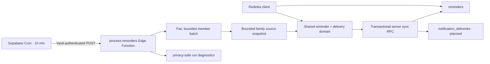

# Server-side reminder processing

Phase 4.1 PR1 keeps Reminder Center responsive in the client while making the
persisted reminder lifecycle independent of an open browser. It deliberately
stops at a durable planned-delivery outbox; browser Web Push is PR2.



## Runtime boundaries

- `src/notifications/reminders.ts` remains the single reminder rule engine.
  The Edge Function imports it directly; it does not maintain a server copy.
- `src/notifications/reminderDelivery.ts` is a pure explicit-timezone scheduler
  shared with tests. It prepares immediate, daily and weekly delivery drafts.
- `process-reminders` authenticates an internal secret, selects at most 100
  linked members, caches one source snapshot per family, and isolates failures
  per member.
- `sync_server_member_reminders` serializes each member with the same advisory
  lock used by the client, upserts deterministic reminder identities, preserves
  read/dismiss state, resolves stale reminders, cancels obsolete outbox rows and
  inserts deliveries with a unique idempotency key.
- Cron uses fair-queue mode ordered by the oldest `last_processed_at`; explicit
  maintenance calls can instead follow the returned UUID cursor.

| Processing stage | Input | Output | Idempotency mechanism |
|---|---|---|---|
| Target selection | Linked members + watermark | Batch of at most 100 members | Fair `last_processed_at` ordering or UUID cursor |
| Source loading | Family ID | Bounded normalized snapshot | One cached snapshot per family/run |
| Rule evaluation | Snapshot, member, preferences, explicit time | Deterministic reminder drafts | Stable reminder dedupe keys |
| Reminder sync | Reminder drafts | Active/resolved reminder rows | Member advisory lock + unique member/dedupe key upsert |
| Delivery planning | Active drafts + persisted state | Immediate/digest drafts | Deterministic occurrence/date/week key |
| Outbox persistence | Delivery drafts | Pending planned deliveries | Unique `idempotency_key` |

## Migrations and tables

Apply `20260714130000_server_reminder_processing.sql`. It adds:

- `notification_deliveries`: server-only planned/push-compatible outbox;
- `notification_processing_runs`: aggregate diagnostics, no source data;
- `notification_processing_state`: per-member fairness/error watermark;
- `get_reminder_processing_targets` and `get_reminder_source_snapshot`;
- `sync_server_member_reminders`;
- `configure_process_reminders_cron`.

The outbox has no authenticated-user RLS policies. Clients cannot enqueue,
deliver or inspect rows. PR2 may add an intentionally scoped history API if the
product needs it.

## Deploy

```powershell
npx supabase db push
npx supabase functions deploy process-reminders --no-verify-jwt --use-api
npx supabase secrets set REMINDER_PROCESSOR_SECRET="<long-random-secret>"
```

`SUPABASE_URL` and `SUPABASE_SERVICE_ROLE_KEY` are provided automatically to a
hosted Supabase Edge Function. Never add either the service-role key or the
processor secret to Vite variables. The API bundler is intentional: the Edge
Function imports the shared domain from `src/`, outside its own directory.

Add the matching values to Vault in Supabase SQL Editor. The URL is the project
base URL, without a trailing slash. The second value must exactly match the Edge
Function `REMINDER_PROCESSOR_SECRET`.

```sql
select vault.create_secret('https://PROJECT_REF.supabase.co', 'rodinka_project_url');
select vault.create_secret('<same-long-random-secret>', 'rodinka_reminder_cron_secret');
select configure_process_reminders_cron();
```

The helper validates both secrets, replaces an existing job of the same name,
and schedules `*/10 * * * *`. The stored cron command reads secrets from Vault
at execution time; it does not contain their plaintext values.

## Local and dry-run invocation

Create an ignored local env file with `SUPABASE_URL`,
`SUPABASE_SERVICE_ROLE_KEY` and `REMINDER_PROCESSOR_SECRET`, then run:

```powershell
npx supabase functions serve process-reminders --no-verify-jwt --env-file supabase/functions/.env.local
$headers = @{ 'x-rodinka-cron-secret' = '<local-secret>' }
$body = @{ batchSize = 10; dryRun = $true } | ConvertTo-Json
Invoke-RestMethod -Method Post -Uri 'http://127.0.0.1:54321/functions/v1/process-reminders' -Headers $headers -ContentType 'application/json' -Body $body
```

Dry-run evaluates targets, reminders and planned deliveries but creates no run,
watermark, reminder or outbox row.

## Production verification

```sql
select jobid, jobname, schedule, active
from cron.job
where jobname = 'rodinka-process-reminders-10m';

select status, started_at, finished_at, users_processed,
       reminders_created, reminders_updated, reminders_resolved,
       deliveries_created, deliveries_cancelled, warnings_count, errors_count
from notification_processing_runs
order by started_at desc
limit 10;

select delivery_type, channel, status, count(*)
from notification_deliveries
group by delivery_type, channel, status;
```

## Rollback

Stop scheduling before reverting application code:

```sql
select cron.unschedule(jobid)
from cron.job
where jobname = 'rodinka-process-reminders-10m';
```

Then redeploy the previous Edge Function revision or delete the function. Keep
the outbox and processing tables during rollback so diagnostics and pending
delivery intent are not destroyed. Vault secrets can be removed separately
after the rollback has been verified.

## Current delivery behavior

Immediate delivery drafts are created only when `push_enabled` is explicitly
true. Quiet reminders remain in-app when `quiet_push_enabled` is true. Daily
digests default to 08:00 local time; weekly digests default to Sunday 18:00.
Quiet hours defer planned delivery to their next local end, including intervals
crossing midnight. The UI currently keeps daily and weekly digest mutually
exclusive, and the server preserves that contract.

Rows use channel `planned`: no subscription, VAPID key, service-worker event or
browser push endpoint exists in PR1. PR2 will claim eligible rows and perform
actual Web Push delivery.

| Delivery type | Trigger | Grouping | Idempotency key | Current delivery status |
|---|---|---|---|---|
| Immediate | Fresh unread reminder and explicit `push_enabled` | Reminder/group occurrence | `immediate:{member}:{dedupe}:{occurrenceHash}` | Planned only |
| Daily digest | Enabled, after 08:00 recipient-local time, non-empty | Recipient local date | `daily-digest:{member}:{localDate}` | Planned only |
| Weekly digest | Enabled, Sunday after 18:00 recipient-local time, non-empty | Recipient ISO week | `weekly-digest:{member}:{isoWeek}` | Planned only |

| Environment item | Location | Public or secret | Purpose |
|---|---|---|---|
| `SUPABASE_URL` | Edge built-in | Server configuration | Project API base URL |
| `SUPABASE_SERVICE_ROLE_KEY` | Edge built-in | Secret | Server-only database access |
| `REMINDER_PROCESSOR_SECRET` | Edge Function secrets | Secret | Authenticate internal invocations |
| `rodinka_project_url` | Supabase Vault | Server configuration | Cron invocation URL |
| `rodinka_reminder_cron_secret` | Supabase Vault | Secret | Must match the Edge processor secret |
